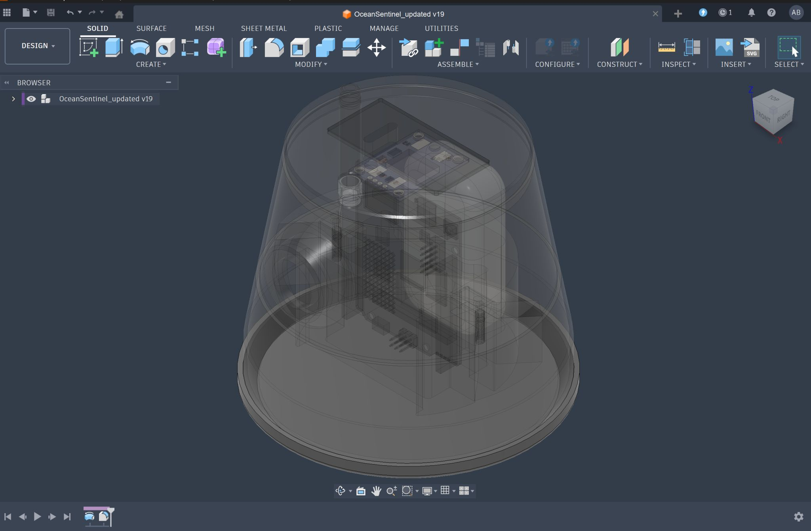
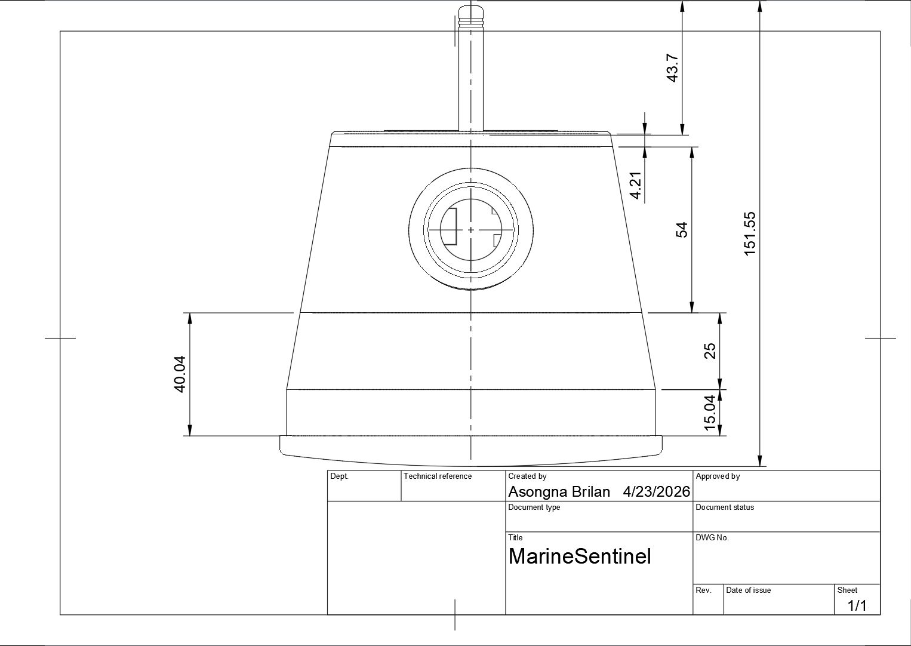
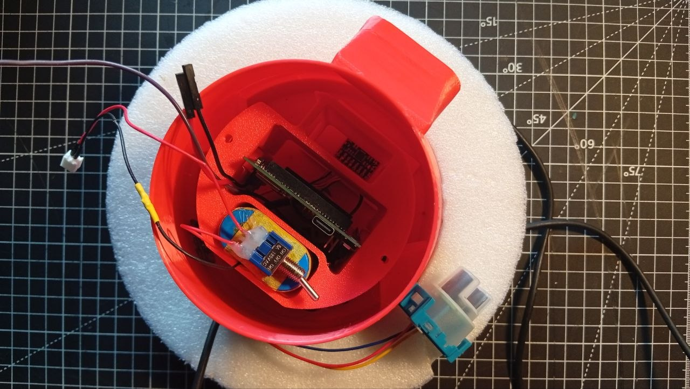
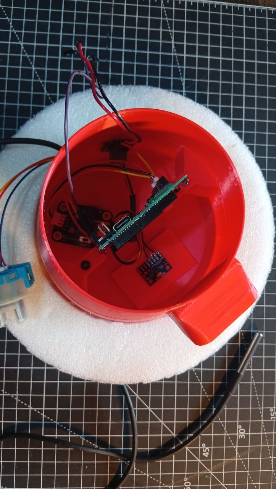
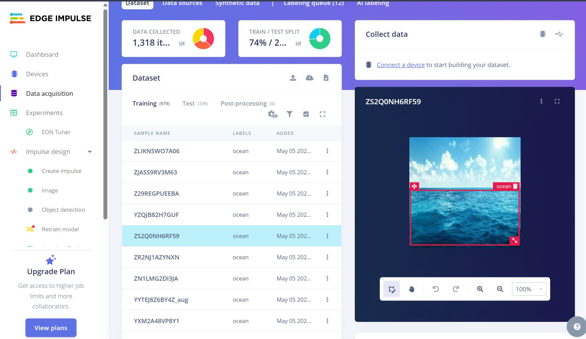
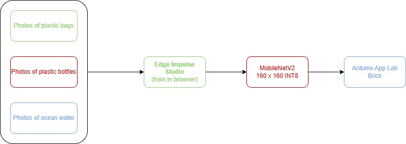
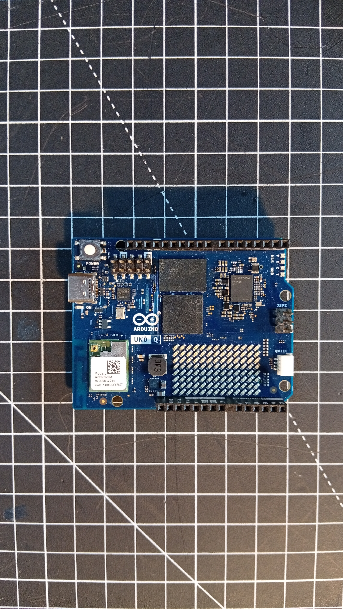
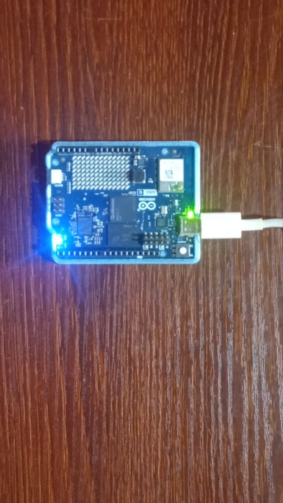

# 🌊 MarineSentinel

**A ~$300 floating AI sentinel that watches a river or coastline for plastic
pollution around the clock, and logs water quality — built on a single
Arduino UNO Q.**



📖 Full project write-up (story + build photos):
[hackster.io/abrilannso/marinesentinel-60f927](https://www.hackster.io/abrilannso/marinesentinel-60f927)
&nbsp;·&nbsp; 🔧 Technical deep-dive:
[`firmware/README.md`](firmware/README.md)
&nbsp;·&nbsp; 👤 Built by
[Asongna Brilan Nso Nkengafac](https://www.hackster.io/abrilannso)

---

## Contents

1. [Overview](#overview)
2. [At a glance](#at-a-glance)
3. [How it works](#how-it-works)
4. [Bill of materials](#bill-of-materials)
5. [Build guide](#build-guide)
6. [Repository layout](#repository-layout)
7. [Troubleshooting](#troubleshooting)
8. [Conclusion](#conclusion)
9. [Credits](#credits)

---

## Overview

MarineSentinel started on a visit to Limbe Down Beach (Cameroon), watching
plastic wash in through the drains and inlets that feed the ocean — water
that local fishing communities depend on. Almost nobody measures any of this
continuously: pollution is recorded, if at all, by someone travelling to a
site to take one photo or one sample. A commercial multi-parameter water
sonde costs US$25,000–40,000, so no local municipality instruments a river,
and "we have no numbers" becomes the reason cleanup funding proposals fail.

MarineSentinel is a small sealed buoy that floats on the water and watches
it for you, day and night:

- A **camera + on-device AI model** learns what floating plastic and debris
  look like and flags it when it sees it.
- Onboard sensors continuously measure **turbidity**, **water temperature**,
  and the buoy's own **tilt/motion** from the waves.
- A **GPS fix** locates every reading and every alert.
- Everything is served live from a **web dashboard the buoy hosts itself**
  over WiFi — open it on a phone at the water's edge, no internet required.

It doesn't scoop up trash — it's the sensor layer for someone else's
cleanup: it tells a crew *where* and *when* debris is flowing, and warns
people who depend on the water the moment a reading looks wrong. Every part
is buyable locally within 48 hours, so a local workshop can rebuild or
repair it without waiting on an import.

## At a glance

| | |
|---|---|
| **Board** | Arduino UNO Q (STM32 MCU + Linux MPU on one board) |
| **Cost** | ~US$300 all-in, nothing imported |
| **Senses** | Turbidity · water temperature · tilt/orientation (IMU) · GPS |
| **AI** | On-camera debris detection — built-in YOLO-X or a custom Edge Impulse model |
| **Output** | Self-hosted live web dashboard (`http://<board-ip>:7000`), no internet needed |
| **Enclosure** | 3D-printed PETG, 5 snap-together parts, solar-trickle powered |

**Status — bench-proven and water-tested, end to end:**
- ✅ Live camera feed with on-device debris detection (YOLO-X / custom Edge Impulse model)
- ✅ Turbidity + temperature sampled every 2 s, with alert thresholds
- ✅ IMU-driven 3D tilt view at 10 Hz, with a capsize/listing alert
- ✅ GPS fix pushed to the dashboard at 1 Hz
- ✅ Sensor/orientation/detection history logged to on-device InfluxDB
- ✅ Camera and IMU startup are retry-safe — a missing sensor fails open instead of crashing the app

## How it works

The Arduino UNO Q carries two processors on one board, and MarineSentinel
gives each the job it's built for, passing messages between them over
[Arduino App Lab](https://docs.arduino.cc/software/app-lab/)'s **Router
Bridge**:

```
┌──────────────────────────────┐                     ┌──────────────────────────────────┐
│  MCU (Zephyr sketch)         │  Router Bridge:      │  MPU (Python / web_ui)            │
│  sketch/sketch.ino           │  sensor_data (2s)    │  python/main.py                    │
│                               │  imu_data (100ms)     │                                    │
│  A0      ── turbidity sensor │  gps_data (1s)          │  ├─ sensors.py (state + alerts)  │
│  D4      ── DS18B20 (1-Wire) │ ────────────────────────▶│  ├─ data_store.py (InfluxDB)     │
│  QWIIC   ── MPU6050 IMU      │                          │  ├─ assets/ (static HTML/JS —    │
│            (I2C4 = Wire1)    │  ◀────────────────────  │  │   CSS-3D capsule, no CDN)      │
│  D20/D21 ── GPS (Serial3)    │  set_alert(bool)      │  └─ VideoObjectDetection             │
│  LED3    ── alert indicator  │                     │        (YOLO-X / custom Edge Impulse) │
└──────────────────────────────┘                     └──────────────────┬─────────────────────┘
                                                                          │ :7000 (Socket.IO)
                                                                          ▼
                                                           Browser dashboard (LAN) — camera pane
                                                           and orientation view refresh at 10 Hz,
                                                           independent of the rest of the page
```

1. **The real-time microcontroller reads the world.** The sketch samples
   turbidity and a DS18B20 water-temperature probe every 2 s, fuses the
   MPU6050 accelerometer + gyroscope into roll/pitch/yaw at 10 Hz, parses
   GPS NMEA sentences continuously, and drives the onboard RGB LED
   green/red as a local alarm — all independent of whether Python is even
   listening.
2. **The Linux processor runs the AI and the dashboard.** An always-on
   Python process (`arduino:web_ui`) runs object detection on the USB
   camera feed, converts raw sensor values to engineering units, evaluates
   alert thresholds (including a capsize/listing check on tilt), writes
   history to an on-device InfluxDB, and serves a static dashboard.
3. **The two halves stay in sync over the bridge.** The sketch fires
   `sensor_data`, `imu_data`, and `gps_data` up to Python; Python sends
   `set_alert` back down to drive the LED.

Three App Lab bricks do the heavy lifting (declared in
[`firmware/app.yaml`](firmware/app.yaml)):

| Brick | Purpose |
|---|---|
| `arduino:video_object_detection` | Object detection (built-in YOLO-X, or a custom Edge Impulse export) on the USB camera stream |
| `arduino:web_ui` | Always-on Python process + the Socket.IO dashboard on port `7000` |
| `arduino:dbstorage_tsstore` | InfluxDB-backed time-series storage for sensor/orientation history |

<details>
<summary><strong>Why this needs two processors, and why <code>web_ui</code> instead of Streamlit</strong> (click to expand)</summary>

- **Two processors, one board.** The real-time MCU owns the sensors and
  electronics; the Linux side only carries the vision model and dashboard —
  no separate SBC + microcontroller pair to wire together.
- **App Lab bricks instead of hand-rolled services.** The camera model
  runner, the dashboard, the time-series database, and start-on-boot all
  arrive as declared components in `app.yaml`.
- **`web_ui`, not Streamlit.** Streamlit only executes app code the first
  time a browser opens the dashboard — on an unattended buoy deployment
  where nobody opens the dashboard, the Bridge providers, camera/AI
  detector, and InfluxDB storage would never start at all. `web_ui` is a
  plain always-on process: everything starts the instant the app boots,
  dashboard or not.
- **The 3D capsule tilt indicator** is drawn with plain CSS 3D transforms —
  no Three.js, no CDN — so it still renders for a browser that can only
  reach the buoy itself, out on the water with no path to anywhere else.
- **The repo mirrors the device.** [`firmware/`](firmware) is exactly the
  on-device app layout — what you clone is what runs.

See [`firmware/README.md`](firmware/README.md) for the full changelog and
the non-obvious bugs this surfaced along the way (I²C bus selection on the
QWIIC connector, Bridge/`App.run()` ordering, etc.).

</details>

## Bill of materials

Everything beyond the UNO Q itself came to roughly **157,506 XAF (~US$260)**,
sourced entirely locally — the whole build lands under $300 with no
import/customs step on the critical path.

| Component | Notes |
|---|---|
| Arduino UNO Q | the board — MPU + MCU |
| USB webcam (e.g. Logitech HD Pro) | debris-detection camera |
| MPU6050 6-DOF IMU (e.g. DFRobot breakout) | mounts on the QWIIC connector |
| DS18B20 waterproof temperature probe | 1-Wire, e.g. DFRobot Gravity |
| GPS receiver (e.g. Adafruit Ultimate GPS Breakout) | NMEA over `Serial3` |
| Turbidity sensor, phototransistor output | e.g. SEN0189-class module |
| Solar panel, 2.5 W + buck converter | trickle-charges the buoy in the field |
| Li-Ion battery, 1000 mAh | onboard power |
| PETG filament | for the 3D-printed enclosure |
| 2× M3 screws | the only fasteners — the enclosure snaps together |

## Build guide

Follow these in order. Steps 1–4 are mechanical/electrical and can be done
without the board powered on; steps 5–8 bring the firmware up.

### Step 1 — 3D-print the enclosure

Print the five parts from [`mechanical/stl/`](mechanical/stl) in PETG (STEP
source: `mechanical/stl/MarineSentinel.step`). They snap together with just
2× M3 screws — no glue.

| Part | Holds |
|---|---|
| **Buoy Cover** | solar panel, GPS antenna, charging/power electronics |
| **Buoy Mid Body** | the camera, for live footage |
| **Buoy Bottom** | the IMU and water-facing sensors |
| **Buoy Floating Base** | flotation (polythene foam) |
| **Electronics Enclosure** | the UNO Q, battery, and wiring |



### Step 2 — Wire power and solar

Mount the 2.5 W solar panel and GPS antenna on the **Buoy Cover**'s top
side; mount the charging circuit, buck converter, and battery on its
underside.



### Step 3 — Mount electronics and sensor modules

1. Place the turbidity + temperature sensor module in the **Buoy Bottom**.
2. Seat the 7.4 V battery pack in the **Electronics Enclosure**.
3. Slide the UNO Q onto the guide rail, then close the enclosure over it.



### Step 4 — Final assembly

Snap the Buoy Bottom, Mid Body, Cover, and Electronics Enclosure together
onto the Floating Base and drive in the two M3 screws. Double-check every
sensor cable is routed before closing the capsule — it's sealed once
assembled.

### Step 5 — (Optional) train a custom debris model in Edge Impulse

The built-in `arduino:video_object_detection` brick ships a general-purpose
YOLO-X model that already recognizes common floating objects. For
debris-specific detection instead:

1. Create a project on [Edge Impulse Studio](https://www.edgeimpulse.com/).
2. Collect and label photos (e.g. plastic bags, plastic bottles, open ocean
   water).
3. Train an object-detection model and export it via Edge Impulse's **App
   Lab export** — no manual model files or SDK calls to manage.

 

### Step 6 — Install Arduino App Lab and set up the board

1. Install [Arduino App Lab](https://www.arduino.cc/en/software/).
2. Connect the UNO Q with a USB-C cable.
3. On first connection, App Lab prompts you to name the board, set a
   password, and join it to your WiFi (or a local hotspot) — do that.

 

### Step 7 — Clone and load the app

From the board's shell (SSH, or App Lab's built-in terminal) for full
control over the files:

```bash
git clone https://github.com/Asongnabrilan-nso/MarineSentinel_v1.git ~/ArduinoApps/MarineSentinel_v1
```

Open `~/ArduinoApps/MarineSentinel_v1/firmware` as the app in App Lab (or
just use the CLI directly — see Step 8).

### Step 8 — Point `app.yaml` at your model, then run it

If you trained a custom model in Step 5, register it and point the app at
it — otherwise skip straight to `app start` and the built-in YOLO-X model
is used:

```bash
arduino-app-cli model list          # confirm your Edge Impulse import shows up
```

```yaml
# firmware/app.yaml
bricks:
  - arduino:video_object_detection:
      model: ei-model-XXXXXX-N      # the ID from `model list`
```

Then build, flash, and launch everything in one command:

```bash
arduino-app-cli app start ~/ArduinoApps/MarineSentinel_v1/firmware
```

This compiles and flashes `sketch/sketch.ino` to the MCU, builds the Python
environment, and starts the dashboard + video-detection runner + InfluxDB.
First start takes a few minutes while dependencies download.

> ⚠️ `app start` **stops whatever app is currently running** on the board —
> only one App runs at a time.

Make sure the USB camera is plugged in (use a USB-C hub if the board's
port is occupied) before starting.

### Step 9 — Open the dashboard

From any device on the same WiFi/LAN as the board:

```
http://<board-ip>:7000
```

You should see live turbidity/temperature tiles, the orientation capsule
tracking the buoy's tilt, a live annotated camera feed, and a debris
detection log.

**Everyday commands, once it's running:**

```bash
arduino-app-cli app restart ~/ArduinoApps/MarineSentinel_v1/firmware      # apply code changes
arduino-app-cli app logs    ~/ArduinoApps/MarineSentinel_v1/firmware --follow   # Python logs
arduino-app-cli monitor                                                   # MCU Serial.print()
arduino-app-cli app stop    ~/ArduinoApps/MarineSentinel_v1/firmware
```

## Repository layout

```
MarineSentinel_v1/
├── firmware/               # the Arduino App — this is what you clone onto the board
│   ├── app.yaml             # manifest + brick declarations
│   ├── python/                # main.py, sensors.py, data_store.py
│   ├── sketch/                  # sketch.ino, sketch.yaml
│   ├── assets/                    # static dashboard (HTML/JS/CSS, Socket.IO)
│   └── README.md                    # full technical write-up, wiring, troubleshooting
├── mechanical/              # Fusion 360 STEP + STL files for the enclosure
├── media/                   # build/CAD/dashboard photos used in this README
└── marinesentinel_spec.json # project spec (requirements, BOM, timeline)
```

## Troubleshooting

Camera not found, IMU not detected, GPS stuck without a fix, dashboard
feeling stuck — the full troubleshooting table, wiring reference, and the
reasoning behind each fix live in
[`firmware/README.md` → §3.4 Troubleshooting](firmware/README.md#34-troubleshooting).

That file is also the place to look for:
- [Adding more sensors](firmware/README.md#5-adding-more-sensors) (worked
  example, e.g. a pH sensor)
- [Loading a different Edge AI model](firmware/README.md#4-loading-a-different-edge-ai-model-edge-impulse)
- The dated [changelog](firmware/README.md#7-changelog) of what changed and
  why

## Conclusion

MarineSentinel started from a simple frustration: the water that needed
watching the most was the water nobody could afford to watch. A
US$25,000–40,000 sonde was never going to sit in a river in Cameroon, so the
only way to get numbers was to build something that could.

What's in this repo is a buoy built almost entirely from parts on a local
bench — turbidity, temperature, tilt, GPS, and a camera with an AI model
that already knows what a plastic bottle looks like — running on one board,
reporting itself over a dashboard with no internet needed. It isn't a
finished monitoring network. It's proof that a $300, locally-sourced
instrument can do the job a $30,000 imported one was priced to do, and that
someone at the water's edge can read it on their phone.

It's also not a cleanup tool, and it doesn't pretend to be. MarineSentinel's
job stops at telling someone *where* the debris is and *when* the water
turns bad — the cleanup crew, the health warning, the funding case built on
real data instead of a single photo, that's for whoever picks up what it
reports.

**What's next:**

- **Longer deployments** — the current build is bench- and water-tested in
  short runs; the real test is weeks on the water unattended.
- **A magnetometer** — to fix the yaw drift (see
  [`firmware/README.md` §2.6](firmware/README.md#26-yaw-has-no-accelerometer-equivalent-correction--it-will-drift))
  and give the buoy a real compass heading, not just relative orientation.
- **More water-quality sensors** (pH, dissolved solids) — the sensor
  pipeline is built to make this a small, worked-example change, not a
  redesign (see
  [`firmware/README.md` §5](firmware/README.md#5-adding-more-sensors)).
- **More than one buoy** — a single sentinel gives you a point reading; a
  handful along a coastline gives you a map of where the pollution is
  actually coming from.

Every file, every model, every STL is in this repo. If the water near you
has the same problem — no data because no one can afford to collect it —
this is built to be cloned, not just read about.

## Credits

Built by [Asongna Brilan Nso Nkengafac](https://www.hackster.io/abrilannso).
Full project story, build log, and step-by-step assembly photos:
[hackster.io/abrilannso/marinesentinel-60f927](https://www.hackster.io/abrilannso/marinesentinel-60f927).

Source is licensed Mozilla Public License 2.0 (see SPDX headers in
`firmware/python/` and `firmware/sketch/`).
